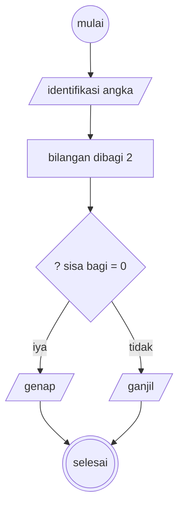

# flowchart menentukan bilangan ganjil genap

```mermaid
flowchart TD
A@{ shape: circle, label: "mulai"} --> 
B@{ shape: lean-r, label: "identifikasi angka"} --> C@{ shape: rect, label: "bilangan dibagi 2"}
--> D@{ shape: diamond, label: "? sisa bagi = 0"} 
--iya-->z@{ shape: lean-r, label: "genap"}--> F
D
--tidak--> E@{ shape: lean-r, label: "ganjil"}
--> F@{ shape: dbl-circ, label: "selesai"}
```