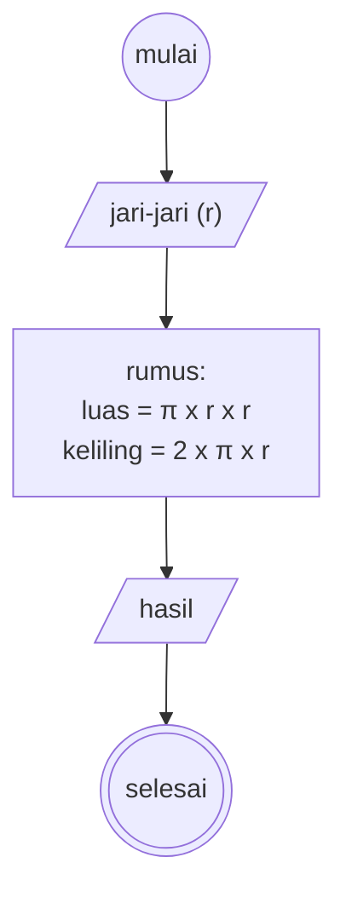

# flowchart menghitung luas dan keliling lingkaran

```mermaid
flowchart TD
A@{ shape: circle, label: "mulai"} -->
B@{ shape: lean-r, label: "jari-jari (r)"} --> 
C@{ shape: rect, label: "rumus: 
luas = π x r x r 
 keliling = 2 x π x r"} -->
G@{ shape: lean-r, label: "hasil"} -->
F@{ shape: dbl-circ, label: "selesai"}


```