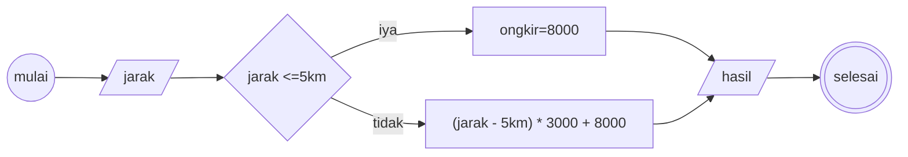

# cek ongkir

```mermaid
flowchart LR
a@{ shape: circle, label: "mulai"} -->
b@{ shape: lean-r, label: "jarak"} -->
c@{ shape: diamond, label: "jarak  <=5km "} --iya-->
d@{ shape: rect , label: " ongkir=8000"}--> f
c --tidak--> e@{ shape: rect , label: "(jarak - 5km) * 3000 + 8000"}-->

f@{ shape: lean-r , label: "hasil"} -->
g@{ shape: dbl-circ , label: "selesai"}
```