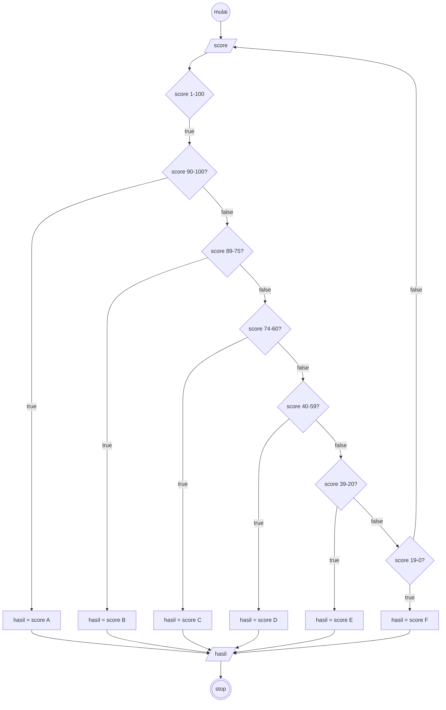

# penentuan score
---

```mermaid
flowchart TD
a@{ shape: circle , label: "mulai"} -->
b@{ shape: lean-r , label: "score"} -->
c@{ shape: diamond , label: "score 1-100"} --true--> f
k --false--> b
f --true--> ff@{ shape: rect , label: "hasil = score A"} --> l
f@{ shape: diamond , label: "score 90-100?"} --false-->
g --true--> gg@{ shape: rect , label: "hasil = score B"} --> l
g@{ shape: diamond , label: "score 89-75?"} --false-->
h --true--> hh@{ shape: rect , label: "hasil = score C"} --> l
h@{ shape: diamond , label: "score 74-60?"} --false-->
i --true--> ii@{ shape: rect , label: "hasil = score D"} --> l
i@{ shape: diamond , label: "score 40-59?"} --false-->
j --true--> jj@{ shape: rect , label: "hasil = score E"} --> l
j@{ shape: diamond , label: "score 39-20?"} --false-->

k@{ shape: diamond , label: "score 19-0?"} --true-->


d@{ shape: rect , label: "hasil = score F"} --> l

l@{ shape: lean-r , label: "hasil"} -->
z@{ shape: dbl-circ , label: "stop"}
```